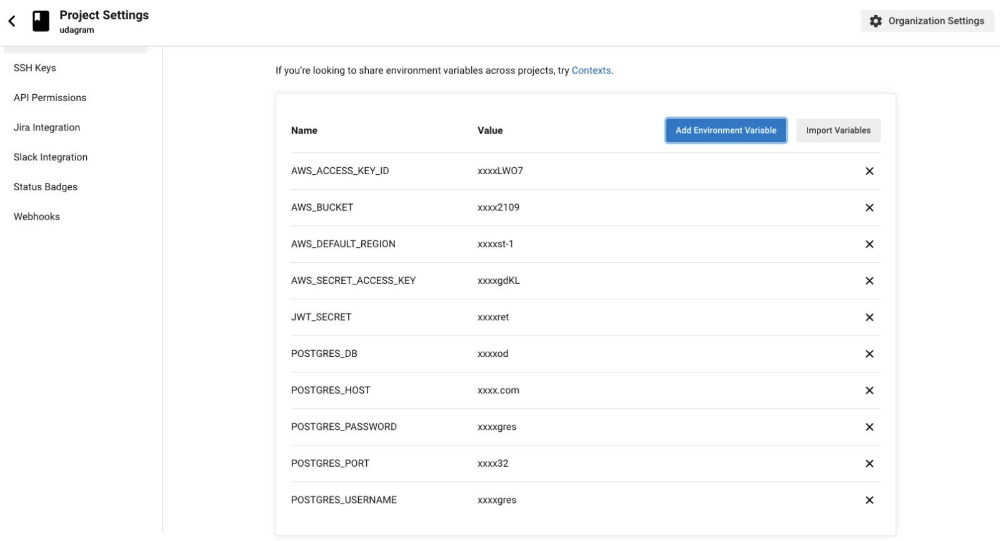

# Udagram

This project demonstrates on how to host web application (frontend, backend, database) in AWS cloud.

Application link: http://udagram-web.s3-website-us-east-1.amazonaws.com

## Application Feature List

- Register new user and login for existing user
- Upload image and caption
- View uploaded image and caption

## Project Setup

```sh
npm run deploy
```

### Install AWS CLI and EB CLI to support local deployment to AWS platform

AWS CLI: https://docs.aws.amazon.com/cli/latest/userguide/install-cliv2-windows.html

EB CLI: https://docs.aws.amazon.com/elasticbeanstalk/latest/dg/eb-cli3-install-windows.html

## Screenshots

Below are the screenshots from the latest built

### RDS - Database


### Elastic Beanstalk - API Server


### Amazon S3


### CircleCI

#### Dashboard 


#### Environment Variables



#### Frontend_build_deploy


#### Backend_build_deploy


